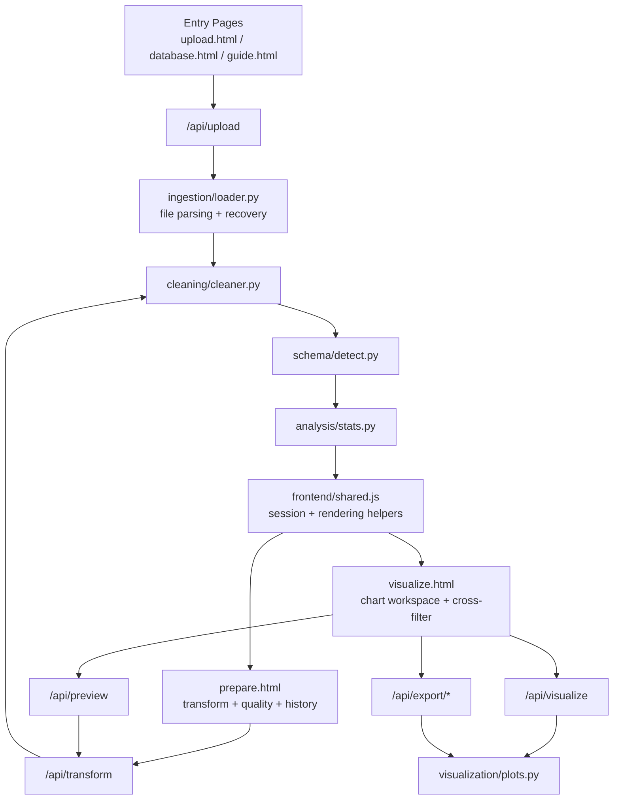

# Memory Graph

This is the living map of the app's active logic, shared state, and known cleanup decisions. Update this file whenever a major workflow, module boundary, or storage shape changes.

## Current Flow

## Active Shared State

- Browser session key: `data_visualisation_tool_session`
- Workspace key: `data_visualisation_tool_workspaces`
- Per-table state lives in `shared.js` via:
  - `buildTableRecord`
  - `mirrorActiveTableIntoSession`
  - `syncActiveTableIntoSession`
  - `setActiveTable`

## Canonical Shared Frontend Helpers

These are the shared helpers pages should use instead of re-implementing behavior inline:

- `setStatusText`
- `renderWorkspaceTablePanel`
- `switchWorkspaceTable`
- `ensureDatasetState`
- `saveWorkspaceFlow`
- `saveSession` / `loadSession`
- `fetchJson` / `downloadBinary`

## Redundancy Audit

### Cleaned up

- Chart rendering now goes through `_build_chart_bytes` in [D:\Data Visualisation Tool\app.py](D:\Data%20Visualisation%20Tool\app.py) instead of repeating `create_chart(...)` wiring everywhere.
- Workspace switching and workspace-save flow now have shared runtime helpers in [D:\Data Visualisation Tool\frontend\shared.js](D:\Data%20Visualisation%20Tool\frontend\shared.js).
- Parser heuristics for JSON, ZIP, headerless files, and Excel ranking are concentrated in [D:\Data Visualisation Tool\ingestion\loader.py](D:\Data%20Visualisation%20Tool\ingestion\loader.py).
- `prepare.html` and `visualize.html` now use the shared workspace helpers without keeping old live fallback bodies in place for switching and workspace-save flows.

### Still partially duplicated

- Page-level chart rendering and preview wiring still live inline in `prepare.html` and `visualize.html`.
- The next cleanup pass should extract those page scripts into separate JS modules once the workflow surface settles.

## Active Assets

- Live header mark:
  - [D:\Data Visualisation Tool\frontend\assets\vysri-reference-mark.png](D:\Data%20Visualisation%20Tool\frontend\assets\vysri-reference-mark.png)

## Residuals Removed Or Ignored

- Scratch validation files are ignored through `.gitignore`:
  - `tmp_*`
- Exploratory internet sample downloads are ignored:
  - `regression/internet_samples/`
- `package-lock.json` is ignored because this repo is not maintaining an active Node package workflow.

## Known Cleanup Targets

Remove these if they are still not referenced in the next pass:

- `frontend/assets/vysri-built-mark.svg`
- `frontend/assets/vysri-services-logo-cropped.png`
- `frontend/assets/vysri-services-logo.svg`
- tracked but currently unused:
  - `frontend/assets/vysri-services-logo.png`
  - `frontend/assets/vysri-services-wordmark.png`

## Regression Baseline

Canonical regression runner:

- [D:\Data Visualisation Tool\scripts\run_regression_checks.py](D:\Data%20Visualisation%20Tool\scripts\run_regression_checks.py)
- [D:\Data Visualisation Tool\scripts\run_workspace_regression_checks.js](D:\Data%20Visualisation%20Tool\scripts\run_workspace_regression_checks.js)

Core fixture families:

- delimited structured data
- headerless `.data`
- ZIP-wrapped datasets
- nested JSON
- mixed-schema JSON arrays
- multi-sheet Excel
- ambiguous workbook sheet selection
- empty-file rejection
- multi-file workspace reopen and per-table state restoration

## Update Rule

Update this file when any of these change:

- session storage shape
- table-switching logic
- upload formats or parser recovery rules
- chart rendering pipeline
- exported asset/logo choice
- regression fixture coverage
